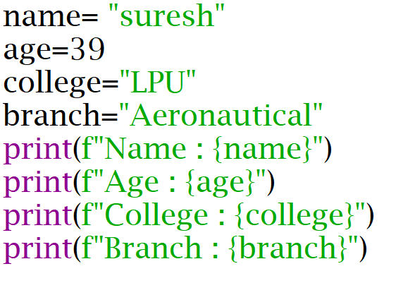
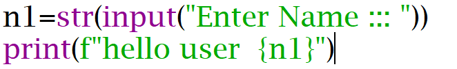
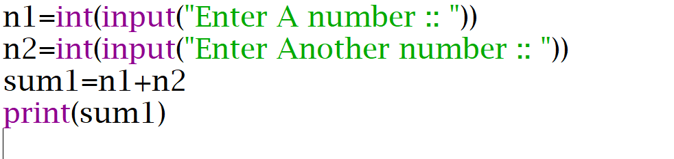

# First-Steps-Python

This repository contains some basic Python programs useful for beginners.

## Program 1 — Print name, age, college and branch.

### Problem Statement

Write a Python program to Print name, age, college and branch.

### Code

### Output

[Click here to view the output](output1.png)

## Program 2 — Take name as input and greet the user.

### Problem Statement

Write a Python program to Take name as input and greet the user.

### Code

### Output

[Click here to view the output](output2.png)

## Program 3 — Take two numbers and display their sum

### Problem Statement

Write a Python program to Take two numbers and display their sum.

### Code

### Output

[Click here to view the output](output3.png)
