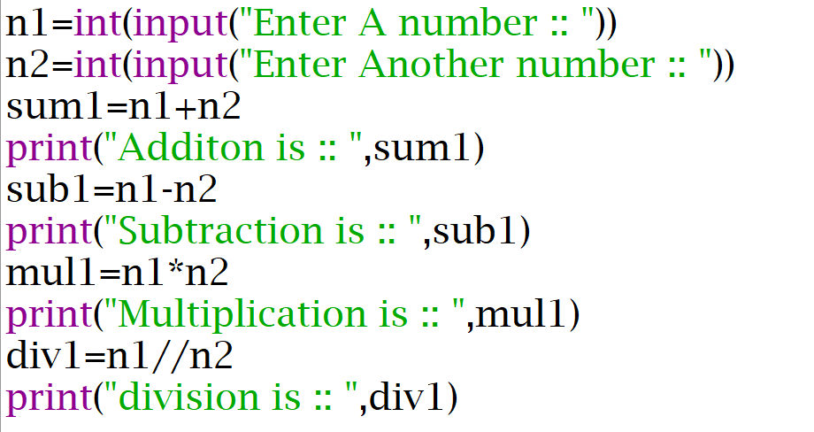
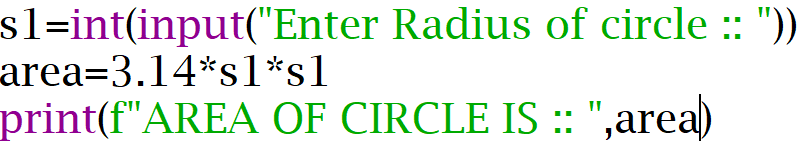
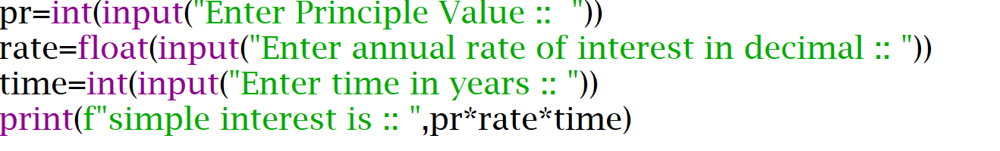
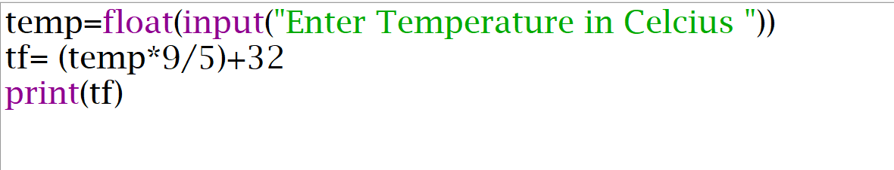
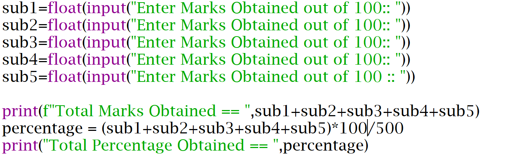

# First-Steps-Python

This repository contains some basic Python programs useful for beginners.

## Program 1 — Print name, age, college and branch.

### Problem Statement

Write a Python program to Print name, age, college and branch.

### Code

### Output

[Click here to view the output](output1.png)

## Program 2 — Take name as input and greet the user.

### Problem Statement

Write a Python program to Take name as input and greet the user.

### Code

### Output

[Click here to view the output](output2.png)

## Program 3 — Take two numbers and display their sum

### Problem Statement

Write a Python program to Take two numbers and display their sum.

### Code

### Output

[Click here to view the output](output3.png)

## Program 4 — Arithmetic Operations on Two Numbers

### Problem Statement

Write a Python program to take two numbers as input and perform all basic arithmetic operations on them.

### Code

### Output

[Click here to view the output](output4.png)

## Program 5 — Area of a Circle

### Problem Statement

Write a Python program to take the radius of a circle as input and calculate and display its area.

### Code

### Output

[Click here to view the output](output5.png)

## Program 6 — Simple Interest

### Problem Statement

Write a Python program to take the principal amount, rate of interest, and time as input and calculate and display the simple interest.

### Code

### Output

[Click here to view the output](output6.png)

## Program 7 — Convert Celsius to Fahrenheit

### Problem Statement

Write a Python program to take the temperature in Celsius as input and convert it into Fahrenheit.

### Code

### Output

[Click here to view the output](output7.png)

## Program 8 — Calculate Total and Percentage of 5 Subjects

### Problem Statement

Write a Python program to take the marks of five subjects as input and calculate and display the total marks and percentage.

### Code

### Output

[Click here to view the output](output8.png)
